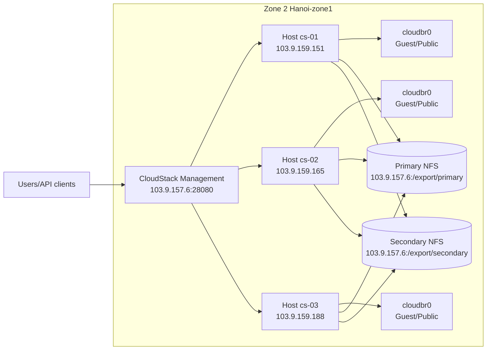

# CloudStack Zone2 Stabilization Runbook

## Scope
This runbook captures the stabilization work for zone `Hanoi-zone1` (zone id `2`) in this environment.

## Current Architecture



## IP Model (Private vs Public)
- Public IP: IP exposed to external traffic, typically attached to Virtual Router and NAT/LB rules.
- Private IP: IP used inside cloud internal networks (guest/control/management), not directly internet-routable.
- In Advanced zone mode, a VM in a guest network usually uses private IP and reaches internet through Virtual Router NAT.

## Storage Model (Primary vs Secondary)
- Primary storage (`/export/primary`): active VM disks (ROOT/DATA volumes). VM lifecycle (deploy/start/stop) depends on it.
- Secondary storage (`/export/secondary`): templates, ISOs, snapshots, SystemVM artifacts.
- Key rule: user VM deploy needs both:
  - template `READY` on secondary,
  - writable/attachable primary pool on selected host.

## What Was Fixed
1. Primary pool endpoint was wrong in DB:
- Before: pool `Primary01` pointed to `103.9.159.151:/export/secondary`.
- After: corrected to `103.9.157.6:/export/primary`.

2. Host reconnect and pool attach recovery:
- Restarted `libvirtd` and `cloudstack-agent` on all KVM hosts.
- Verified hosts can mount `103.9.157.6:/export/primary`.

3. Secondary store normalization:
- Removed stale removed records `image_store.id in (2,3)`.
- Kept only active zone2 secondary store:
  - `image_store.id=4`, URL `nfs://103.9.157.6/export/secondary/`.

4. Stuck state re-check:
- No VM remains in `Starting` state.
- `network1` moved from `Implementing` to `Allocated`.

## Verified Runtime State
- Routing hosts (non-removed) are `Up/Enabled`.
- Pool attach log now shows successful connection events for corrected primary endpoint.
- VM `i-2-54-VM` no longer stuck in `Starting` (now `Expunging` after failed attempt).

## Smoke Test Status (Deploy/Start/Ping/SSH)
Smoke test automation was executed via signed API calls on:
- endpoint: `http://103.9.157.6:28080/client/api`

Result:
- API authentication works.
- Deploy attempt fails with `error 530` because template is not ready:
  - `Template ... has not been completely downloaded to zone ...`
- Current `listTemplates` output shows only one executable template and it is `ready=false`, `status=Processing`.

## Why Smoke Test Is Blocked
User VM deploy cannot pass until at least one user-executable template is fully downloaded and marked `isready=true` in zone2 secondary storage.

## Next Actions To Complete Smoke Test
1. Ensure at least one user template is fully downloaded on secondary storage.
2. Re-run deploy/start smoke flow using:
- zone id: `b38df4d2-8f6a-4320-9d89-0bed286d8841`
- network id (`network1`): `a27f3894-87f4-461d-8eb2-433a113190d3`
- service offering id used in test: `0411ba9a-3589-441c-9387-4ce904f1d043`
3. After VM reaches `Running`, validate connectivity:
- ping private IP from Virtual Router or same guest network path,
- SSH check to VM if template includes SSH and security group/firewall allows it.

## Useful SQL Checks
```sql
-- No stuck starting VMs
select id, instance_name, vm_type, state
from vm_instance
where removed is null and state='Starting';

-- network1 and implementing networks
select id, name, state
from networks
where name='network1' or state='Implementing';

-- active secondary stores
select id, name, removed, url
from image_store
where data_center_id=2
order by id;

-- primary pool target
select id, name, host_address, path, port
from storage_pool
where id=7;
```
